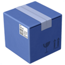

# ILRepack.MSBuild.Task

`KageKirin.ILRepack.MSBuild.Task` contains tasks for MSBuild to run `ILRepack` over a freshly compiled assembly,
in order to infuse it with select IL code of its dependencies.

## 📦 Package information

### `KageKirin.ILRepack.Tool.MSBuild.Task`

This is the tool variant. It requires having ILRepack installed.

### `KageKirin.ILRepack.Lib.MSBuild.Task`

This is the lib variant. It's standalone and ILRepack.Lib has been merged into it.

### 🔧 Installation

```bash
dotnet add package KageKirin.ILRepack.Tool.MSBuild.Task ## tool version
dotnet add package KageKirin.ILRepack.Lib.MSBuild.Task  ## lib version
```

### 📦 Package reference

```xml
<Project>
  <ItemGroup>
    <!-- either -->
    <PackageReference Include="KageKirin.ILRepack.Tool.MSBuild.Task" Version="0.0.0" />
    <!-- or -->
    <PackageReference Include="KageKirin.ILRepack.Lib.MSBuild.Task" Version="0.0.0" />
  </ItemGroup>
</Project>
```

## ⚙️ Configuration

TBD

## 🤝 Collaborate with My Project

Please refer to [COLLABORATION.md](COLLABORATION.md).
